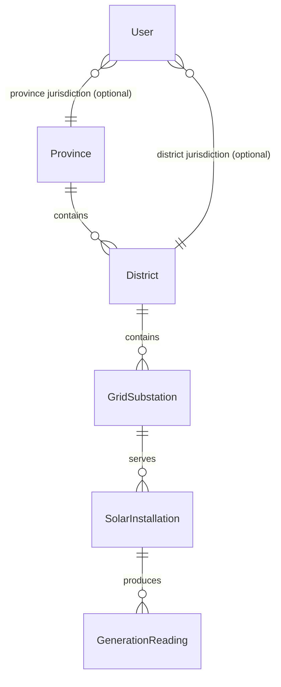

# Data Model

This document describes the MongoDB model used by the Solar Generation API.
The hierarchy is Province → District → Grid Substation → Solar Installation →
Generation Reading. Users are stored separately and are scoped to one
jurisdiction.

## Entity relationships

```text
Province 1 ── * District 1 ── * GridSubstation 1 ── * SolarInstallation 1 ── * GenerationReading

User (separate; jurisdiction is national, province, or district)
```

| Entity | Fields | Relationship |
|---|---|---|
| `Province` | `_id`, `name` | Parent of districts |
| `District` | `_id`, `name`, `provinceId` | `provinceId` references a `Province` |
| `GridSubstation` | `_id`, `name`, `code`, `districtId` | `districtId` references a `District` |
| `SolarInstallation` | `_id`, `name`, `meterId`, `latitude`, `longitude`, `substationId` | `substationId` references a `GridSubstation` |
| `GenerationReading` | `_id`, `installationId`, `timestamp`, `powerKw`, `energyKwh`, `voltage` | `installationId` references a `SolarInstallation` |
| `User` | `_id`, `name`, `email`, `passwordHash`, `role`, `jurisdictionType`, `jurisdictionId` | Jurisdiction reference depends on role |

## User jurisdiction

Each user has one jurisdiction. The `User` schema validates the allowed
combinations:

| `role` | `jurisdictionType` | `jurisdictionId` |
|---|---|---|
| `national` | `all` | `null` |
| `province` | `province` | ID of the assigned Province |
| `district` | `district` | ID of the assigned District |

National users can read all data. Province users are limited to their province
and its descendants. District users are limited to their district and its
descendants. The API enforces this scope when serving read requests.

## Reading behavior

Generation readings form an append-only time series: each measurement is a
separate document. The installation does not store a mutable `lastPower` or
equivalent field. The current reading is derived by selecting the newest
reading for that installation.

The unique compound index on `{ installationId, timestamp }` prevents the same
installation from recording two readings at the same timestamp. Additional
indexes support time ordered reading queries. `meterId` belongs to
`SolarInstallation`; there is no separate device collection. A device token is
associated with one installation for ingestion authorization.

## Collections and indexes

| Collection | Important indexes |
|---|---|
| `provinces` | Unique `name` |
| `districts` | `provinceId`; unique `{ provinceId, name }` |
| `gridSubstations` | Unique `code`; `districtId` |
| `solarInstallations` | Unique `meterId`; `substationId` |
| `generationReadings` | Unique `{ installationId: 1, timestamp: -1 }`; `{ timestamp: -1, installationId: 1 }` |
| `users` | Unique `email` |


